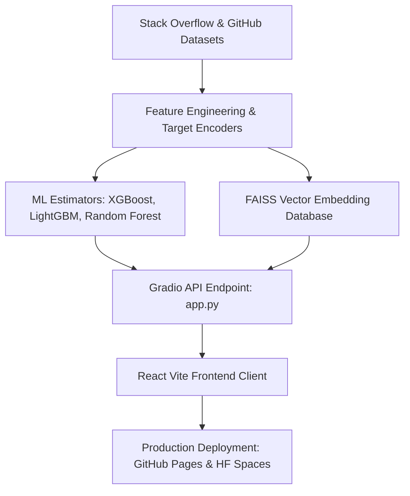

# 🧬 DevIntel: Developer Intelligence & Telemetry Hub

DevIntel is a state-of-the-art predictive analytics platform designed to model and estimate developer profiles using multi-year developer survey repositories. The project integrates robust Python machine learning pipelines, causal inference metrics, and high-dimensional semantic indexing alongside a premium, responsive React-Vite client dashboard.

---

## 📸 Platform Preview
*(Add main platform UI screenshot here)*
<!-- PLACEHOLDER: MAIN_UI_IMAGE -->

*(Add interactive walkthrough GIF here showing dashboard filters and estimator tools)*
<!-- PLACEHOLDER: INTERACTIVE_WALKTHROUGH_GIF -->

---

## 🌟 Key Features

### 📊 Exploratory Data Analysis & Telemetry Matrix
* **Salary Features Weighting**: Live XGBoost feature importances mapping relative weightings.
* **Validation Fit Analysis**: Live comparative validation plots comparing prediction trends vs actual targets.
* **Salary Error Distributions**: Cohort error tracking metrics calculated across junior, mid, and senior levels.
* **Attrition Risk Curves**: Probability assessments mapping churn likelihood frequencies.
* **Model Comparisons**: Area Under the ROC curves comparisons validating performance across Ridge, RandomForest, XGBoost, and LightGBM models.
* **Interactive Filtering Matrix**: Toggle through 6 telemetry metrics using a premium, neon-glowing gradient button selector.

### 🧠 Predictive Calculations Engine (Gradio Embedded)
* **Estimated Compensation**: Advanced regression model predicting market value based on geographical location, experience, educational degrees, and organizational variables.
* **Attrition Risk Tiering**: Inferences mapping retention and attrition churn probabilities (Stable Core Cohort vs Critical Attrition Risk).
* **FAISS Semantic Matcher**: Semantically search over 15,000 developer nodes using natural language descriptions powered by `SentenceTransformer` embeddings and an indexed FAISS vector database.

### 🖥️ Page-by-Page Feature Showcase

#### 🏠 1. Console Home (Dashboard Landing)
* **Visual Scope**: Centered high-density summary metrics, custom neon-teal title headers, and interactive hover cards mapping data shapes.
* **Exploratory Data Selector**: A custom gradient button selector hosting 6 telemetry and model validation graphs.
* *(Place Home Page Screenshot/GIF here)*
<!-- PLACEHOLDER: PAGE_HOME_PREVIEW -->

#### 🧮 2. Predictive Console (Embedded Calculators)
* **Salary Regression Engine**: Predicts compensation based on country, years of code, and company size. Output is styled as a large, centered neon value with a breathing pulse animation.
* **Attrition Risk Grid**: Centered status tiering (Critical, Elevated, Stable) indicating churn risks.
* **Semantic search**: Queries over 15,000 developer nodes using NLP prompts.
* *(Place Calculator Workspace Screenshot/GIF here)*
<!-- PLACEHOLDER: PAGE_CALCULATOR_PREVIEW -->

#### 📈 3. Talent Forecasting
* **Dynamic Projections**: Forecasts technological stack trends.
* **Category Filters**: Restrict metrics dynamically to Languages, Databases, or DevOps segments using sliding blur direction-aware tabs.
* *(Place Forecasting Page Screenshot/GIF here)*
<!-- PLACEHOLDER: PAGE_FORECAST_PREVIEW -->

#### ⚖️ 4. Causal A/B Testing
* **Uplift Modeling**: Simulates job satisfaction changes across remote vs hybrid groups.
* **Interactive Views**: Switch instantly between uplift estimates and standard mean differences balance validation.
* *(Place Causal Analytics Page Screenshot/GIF here)*
<!-- PLACEHOLDER: PAGE_CAUSAL_PREVIEW -->

#### 🌐 5. UMAP Clusters
* **Interactive Scatter Canvas**: Renders clustered roles based on skill similarity.
* **Role Highlights**: Filter nodes by cluster category (DevOps, Web Specialists, Enterprise) to trace spatial separations.
* *(Place UMAP Visualizer Page Screenshot/GIF here)*
<!-- PLACEHOLDER: PAGE_UMAP_PREVIEW -->

#### 🗺️ 6. NLP Profile Map
* **Vector Search Interface**: A high-dimensional search node mapper. Input text search queries to highlight corresponding developer groups dynamically.
* *(Place NLP Search Map Page Screenshot/GIF here)*
<!-- PLACEHOLDER: PAGE_NLP_PREVIEW -->

---

## 🏗️ Project Architecture



### File Hierarchy
* **[`app.py`](file:///C:/Software/dev_analysis_2/app.py)**: Central server engine hosting Gradio inference interfaces, FAISS vector lookups, and CORS patched middleware wrappers.
* **[`frontend/`](file:///C:/Software/dev_analysis_2/frontend/)**: React-Vite SPA console layout styled with custom glassmorphic panels and spotlight effects.
* **[`data/`](file:///C:/Software/dev_analysis_2/data/)**: Data assets repository.
* **[`monitoring/`](file:///C:/Software/dev_analysis_2/monitoring/)**: Model performance telemetry outputs.

---

## 🛠️ Local Development Setup

### Backend (Python)
1. Navigate to the project root:
   ```bash
   pip install -r requirements.txt
   ```
2. Run the local Gradio server:
   ```bash
   python app.py
   ```
   *(Default port: `7860`)*

### Frontend (React)
1. Navigate to the frontend directory:
   ```bash
   cd frontend
   npm install
   ```
2. Run the local development server:
   ```bash
   npm run dev
   ```
   *(Default port: `5173`)*

3. Compile the production bundle:
   ```bash
   npm run build
   ```

---

## 🚀 Deployed Instances
* **Interactive Frontend Console**: [ShivanshKandwal.github.io/dev_analysis_2/](https://ShivanshKandwal.github.io/dev_analysis_2/)
* **Gradio Predictive Engine API**: [Hugging Face Space](https://huggingface.co/spaces/ShivanshKandwal/devintel-hub)
